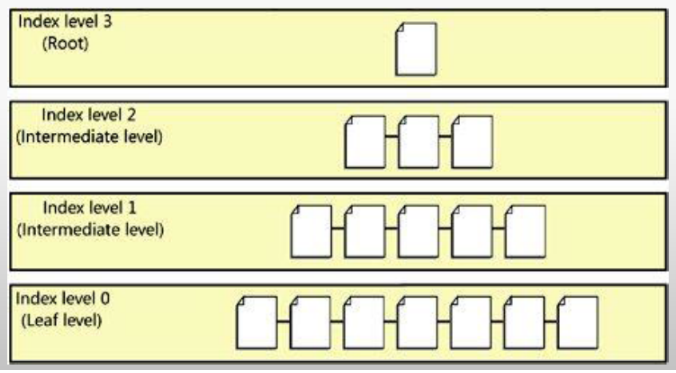

# Power Tuning - Tarefas do Dia a Dia de um DBA

## Tuning

## Análise dos Recursos do Servidor

### Levantar informações do Ambiente

- Conhecer horário de maior movimento do banco, se trabalha 24 x 7, quais horários de janela.
- Analisar consumo de CPU e quantidade cores disponíveis.
- Analisar principalmente a quantidade de memória disponível.
- Conferir a configuração de Memória.
- Conferir espaço em disco disponível no servidor.
- Qual tipo de RAID e discos utiliza.
- Conferir onde as databases estão no servidor.
  
  ```sql
  SELECT a.name, b.name as 'Logical filename', b.filename
  FROM sys.sysdatabases a
  INNER JOIN sys.sysaltfiles b on a.dbid = b.dbid
  ORDER BY a.name
  GO
  ```

---

### Rotina para monitorar o que executa no banco

- **Procedure WhoIsActive:**

  - [Link para download da procedure](https://github.com/amachanic/sp_whoisactive)
  - [Arquivo mais recente (Abril/2024)](./src/sp_whoisactive-12.00/sp_WhoIsActive.sql)
  - Demora mais quando o TempDB está sobrecarregado. Se for o caso, cancele o processamento.
  - [Crie um histórico executando WhoIsActive a cada minuto](./src/DatabaseBaselineWhoisactive.sql)
  - [Utilize a opção otimizada "WhoIsActive Rápida" para casos urgentes](./src/sp_whoisactive-12.00/sp_WhoIsActive-rapida.sql)

---

### Rotina para monitorar queries demoradas

- Server Side Trace (Profile) ou Extended Events ("teoricamente" substituto do Profile).
  - Ao executar o Profile, "SEMPRE, MAS SEMPRE" coloque filtros.
  - Crie um Server Side Trace para guardar tudo que demora mais que 3 segundos no BD. Ele irá processar em background e salvando em um arquivo.
  - Profile usado de forma errada pode parar seu banco de dados, CUIDADO!!!
  - Sempre utilize um Server Side Trace em produção. Evite interface gráfica, ao utilizar, seja RÁPIDO.

---

### Log Contadores SQL Server

Crie uma procedure para logar os principais contadores:

- **Batch Requests/sec:** Número de transações (Select, Update, Delete) por segundo.
- **User Connections:** Conexões ativas no banco (limite de 32.767 conexões).
- **CPU:** Consumo de CPU pelo servidor SQL.
- **Page Life Expectancy (PLE):** Tempo médio que uma página permanece na memória sem necessidade de acesso ao disco.

  | **Valores de Referência do PLE** | **Comentário**                       |
  | -------------------------------- | ------------------------------------ |
  | < 10                             | Excessivamente baixo, risco de erros |
  | < 300                            | Baixo                                |
  | 1.000                            | Razoável                             |
  | 5.000                            | Bom                                  |

  **Como Melhorar:**

  - Adicionar memória ao servidor.
  - Criar índices eficientes.
  - Otimizar queries.

  Obs.: O PLE é um contador e não pode ser alterado diretamente.

- [Nobetbook com Script para criação rotina para logar principais contadores](./src/DatabaseColetaLogContadores.ipynb)

---

### Estatíticas no SQL Server

- Estatísticas são métricas utilizadas pelo Query Optimizer para criar planos de execução otimizados.

- **Problemas com Estatísticas Desatualizadas:**

  - Pode causar estimativas incorretas de cardinalidade, como no exemplo em que o SQL Server preparou um scan na tabela em vez de um seek devido a estimativa errada do número de registros.

  

  A query abaixo mostra as estatísticas de uma Tabela:

  ```sql
  DBCC SHOW_STATISTICS('NomeTabela', 'NomeDaEstatistica')
  WITH HISTOGRAM;
  ```

- **Atualização de Estatísticas:**

  - Antes do SQL Server 2016: 500 + 20% do tamanho da tabela.
  - A partir do SQL Server 2016 (T2371 ativado por padrão): Algoritmo baseado no número de linhas.

  | **Linhas Alteradas** | **Percentual de Alteração** |
  | -------------------- | --------------------------- |
  | 25.000               | 25%                         |
  | 100.000              | 10%                         |
  | 1.000.000            | 3,2%                        |
  | 50.000.000           | 0,5%                        |
  | 100.000.000          | 0,31%                       |

- **Benefícios de Atualizações Frequentes:**

  - Planos de execução otimizados.
  - Evita impacto durante horários críticos, programando para janelas de manutenção.

---

### Fragmentação

- **REORGANIZE**
  - Reorganiza o nível folha dos índices.
  - Não utiliza espaço adicional em disco.
  - Operação delicada e incremental (não perde progresso se cancelada).
  - Não atualiza estatísticas dos índices.

  ```sql
  ALTER INDEX SK01_Teste_Fragmentacao ON Teste_Fragmentacao
  REORGANIZE;
  ```

- **REBUILD**
  - Reconstrói completamente o índice, atualizando estatísticas.
  - Requer espaço adicional em disco temporário.
  - Operação mais disruptiva (perde progresso se cancelada).
  - Permite execução online apenas na versão Enterprise do SQL Server.

  ```sql
  ALTER INDEX SK01_Teste_Fragmentacao ON Teste_Fragmentacao
  REBUILD;
  ```

- Decisão Entre REORGANIZE e REBUILD
  - Fragmentação < 10%: Nenhuma ação necessária.
  - Fragmentação entre 10% e 30%: Use REORGANIZE.
  - Fragmentação > 30%: Use REBUILD.
  - Ignore índices com menos de 1.000 páginas.

- **Cuidados**
  - Evite usar **"Shrink Database"** após REBUILD, pois pode causar fragmentação.
  - Versões anteriores ao SQL Server 2014 com Plano de Manutenção automático podem exigir scripts personalizados.

---

## Automação de Rotinas

### Rotina de Log de Fragmentação de Índices

- Notebook [DatabaseFragmentacaoIndices.ipynb](https://github.com/carlosgimenes/SQL-Server-ceg-database-notebooks/blob/main/Tools/Helth%20Check/DatabaseFragmentacaoIndices.ipynb):

  - Criação de tabelas para armazenar histórico de fragmentação.
  - Criação de views e procedures para análise automatizada.
  - Job para processar verificação de fragmentação.

### Rotina de REBUILD & REORGANIZE

- Notebook [DatabaseRebuildReorganize.ipynb](https://github.com/carlosgimenes/SQL-Server-ceg-database-notebooks/blob/main/Tools/Helth%20Check/DatabaseRebuildReorganize.ipynb):

  - Procedure que decide automaticamente entre REBUILD e REORGANIZE com base na fragmentação.
  - Job para executar as manutenções automaticamente.

**Nota:** Não implemente diretamente em ambientes abandonados ou negligenciados sem uma análise prévia. Execute correções individuais, se necessário, para evitar sobrecarga do arquivo de log.

---

## Índices no SQL Server

Os índices no SQL Server são estruturas criadas para melhorar o desempenho das consultas, organizando os dados em formato de árvore balanceada (B-tree). Eles reduzem o tempo de busca e aumentam a eficiência das operações realizadas no banco de dados.



### Tipos de Índices: Heap, Clustered e Nonclustered

#### **Heap**

- **Definição:** Uma tabela sem um índice clustered.
- **Vantagens:** Pode ser mais rápida para operações de inserção em massa, pois não há necessidade de reorganizar dados.
- **Desvantagens:** Consultas podem ser mais lentas devido à falta de organização; custos de manutenção mais altos e maior fragmentação dos dados.
- **Uso recomendado:** Casos específicos com altos volumes de inserções e baixa demanda de consultas.

#### **Índice Clustered**

- **Definição:** Organiza fisicamente os dados da tabela no disco na ordem das colunas do índice.
  - O nível folha contém todas as colunas da tabela.
- **Características:**
  - Cada tabela pode ter apenas um índice clustered.
  - Ideal para colunas frequentemente usadas em filtros de consultas (ex.: chaves primárias).
  - Beneficia operações que exigem ordenação, como consultas com `ORDER BY` ou buscas por intervalos de valores.

#### **Índice Nonclustered**

- **Definição:** Uma estrutura separada da tabela que armazena os dados das colunas do índice e ponteiros para acessar as linhas correspondentes na tabela base (Heap ou Clustered).
  - Não contém todas as colunas da tabela, sendo menor e mais eficiente para algumas operações.
- **Características:**
  - Permite criar vários índices por tabela.
  - Pode melhorar consultas específicas baseadas nas colunas indexadas.
  - Último nível da estrutura contém referências ao índice clustered ou à Heap.

### Boas Práticas no Uso de Índices

1. **Uso predominantemente do Índice Clustered:**
   - Na maioria das tabelas, um índice clustered é recomendado por oferecer acessos mais rápidos e organizados aos dados.

2. **Heap é indicado em cenários específicos:**
   - Pode ser vantajosa em tabelas com altos volumes de inserções e poucas consultas.

3. **Impacto em Operações de Escrita:**
   - Cada índice precisa ser atualizado para operações de `INSERT`, `UPDATE` ou `DELETE`, o que pode degradar o desempenho se houver muitos índices.

4. **Escolha de Colunas:**
   - Colunas com alta seletividade são boas candidatas para índices.
   - Prefira colunas pequenas para índices clustered, reduzindo o custo de armazenamento e a árvore de dados.

5. **Quantidade de Índices:**
   - Avalie o impacto do espaço em disco e o custo de manutenção dos índices adicionais.

### Importância de Monitoramento e Manutenção

- **Fragmentação:** Use comandos como `ALTER INDEX REORGANIZE` ou `REBUILD` para manter os índices eficientes.
- **Estatísticas Atualizadas:** Atualize estatísticas regularmente para garantir planos de execução precisos.

### Considerações Gerais

- Em uma tabela com índice clustered, o nível folha é a própria tabela.
- Um índice clustered bem projetado é essencial para consultas rápidas, enquanto os nonclustered são ideais para necessidades específicas.

---
