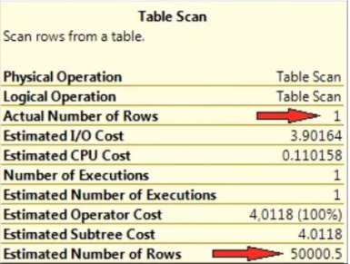

# Power Tuning - Tarefas do Dia a Dia de um DBA

## Tuning

## Análise dos Recursos do Servidor

### Levantar informações do Ambiente

- Conhecer horário de maior movimento do banco, se trabalha 24 x 7, quais horários de janela.
- Analisar consumo de CPU e quantidade cores disponíveis.
- Analisar principalmente a quantidade de memória disponível.
- Conferir a configuração de Memória.
- Conferir espaço em disco disponível no servidor.
- Qual tipo de RAID e discos utiliza.
- Conferir onde as databases estão no servidor.
  
  ```sql
  SELECT a.name, b.name as 'Logical filename', b.filename
  FROM sys.sysdatabases a
  INNER JOIN sys.sysaltfiles b on a.dbid = bdbid
  ORDER BY a.name
  GO
  ```

### Rotina para monitorar o que executa no banco

- Procedure WhoIsActive
  - [Link para download da procedure](http://whoisactive.com/)
  - Demora um pouco quando o Tempdb está ruim, caso demore é só cancelar o processamento.
  - Criar um histórico WhoIsActive >>> rodando a cada 1 minuto.
  - Ver opção WhoIsActive "rápida".

### Rotina para monitorar queries demoradas

- Server Side Trace (Profile) ou Extended Events ("teoricamente" substituto do Profile).
  - Ao executar o Profile, "SEMPRE, MAS SEMPRE" coloque filtros.
  - Crie um Server Side Trace para guardar tudo que demora mais que 3 segundos no BD. Ele irá processar em background e salvando em um arquivo.
  - Profile usado de forma errada pode parar seu banco de dados, CUIDADO!!!
  - Sempre utilize um Server Side Trace em produção. Evite interface gráfica, ao utilizar, seja RÁPIDO.

### Log Contadores SQL Server

- Criação de uma procedure para logar alguns contadores.
  - **BatchRequests**: Transações por segundo no SQL Server (Qualquer Select, Update e Delete).
  - **User Connection**: Quantidade de conexões no banco de dados (Limite de conexões com SQL Server é de 32767 conexões).
  - **CPU**: Consumo de CPU do servidor.
  - **Page LIfe Expectancy (PLE)**: Expectativa de vida em segundos de uma página na memória do SQL Server (Quanto maior este número, maior o tempo de uma página em memória, sem necessidade de ir para disco e com isso menos I/O).

    | **Valores de referência** | **Comentário**                                                       |
    |--------------------------|---------------------------------------------------------------------|
    | < 10                     | Excessivamente baixo, podendo gerar erros, asserts e dumps          |
    | < 300                    | Baixo                                                              |
    | 1000                     | Razoável                                                           |
    | 5000                     | Bom                                                                |

    - Como melhorar
      - Adicionar memória.
      - Índice.
      - Otimizar queries.

    Obs.: O Page Life Expectancy é um Contador, não tenho como alterá-lo.

### Estatíticas no SQL Server

- Estatísticas são objetos do SQL Server que contém métricas de range de valores de uma ou mais colunas e é utilizada pelo Query Optimizer para ajudar a montar o melhor plano de execução para uma query.
- Exemplo de "GRANDE PROBLEMA" de uma estatística desatualizada:
  
  

  Neste exemplo o SQL Server estimava que tinha 50.000 registros para retornar, entretanto, na verdade ele só tinha um registro para retornar, fazendo com que ele se prepara-se para fazer um scan na tabela, quando poderia fazer um seek.

  - A query abaixo mostra as estatísticas de uma Tabela:

  ```sql
  DBCC SHOW STATISTICS('NomeTabela", 'NomeDaEstatística')
  WITH HISTOGRAM
  ```

- As estatísticas nunca ficam 100% atualizadas, a medida que fazemos Insert, Update e Delete elas ficam desatualizadas, sendo necessário regerá-las.
- Algorítmo de atualização de estatísticas no SQL Server:
  - 500 + 20% do tamanho da tabela (antes do SQL Server 2016).
  - Pode acontecer a qualquer momento (inclusive durante o dia).
  - Atualização do tipo SAMPLE (SQL escolhe o % de dados que será analisado).
- Melhorias no Algorítmo de atualização de estatísticas no SQL Server na versão 2016, já vem nativo (T2371).
  - Agora faz em número de linhas:
    - 25.000 - 25%
    - 100.000 - 10%
    - 1.000.000 - 3,2%
    - 50.000.000 - 0,5%
    - 100.000.000 - 0,31%
    Refaz a estatística ao atingir estes números de linhas com estes percentuais de alteração.
- Benefícios de se criar uma rotina de Update Statistics:
  - Com atualizações mais frequentes das estatísticas, temos **"MELHORES PLANOS DE EXECUÇÃO"**.
  - Será realizada na janela da madrugada, evitando impactos na Produção.
  - Atualização do tipo FULL (mais real pois analisa toda a tabela).

### Fragmentação

- REORGANIZE:
  - Mais "Calmo, delicado".
  - Não utiliza espaço em disco a mais para realizar essa operação.
  - Reorganiza os LEAF LEVEL dos índices.
  - Não atualiza as estatísticas dos índices.
  - Se cancelar o comando, não perde o que foi feito, já o REBUILD perde.

  **SINTAXE REORGANIZE**

  ```sql
  ALTER INDEX SK01_Teste_Fragmentacao ON Teste_Fragmentacao
  REORGANIZE
  ```

- REBUILD:
  - Igual a **"Chapa Quente"**.
  - Utiliza espaço em disco temporário para realização do processo.
  - Destrói o índice e cria novamente.
  - **Atualiza as estatísticas dos índices**.
  - Se cancelar o comando, PERDE que foi feito, já o **REORGANIZE** NÃO perde.
  - Causa um Lock grande na tabela quando executado de forma **OFFLINE**. A versão Enterprise do SQL Server permite que se execute um **REBUILD ONLINE**.

  **SINTAXE REBUILD**

  ```sql
  ALTER INDEX SK01_Teste_Fragmentacao ON Teste_Fragmentacao
  REBUILD
  ```

- Quando usar um ou outro? 
  - Se o percentual de fragmentação for menor que 10% não fazer nada.
  - Se a fragmentação estiver entre 10% e 30% faça o REORGANIZE.
  - Se a fragmentação estiver MAIOR que 30% faça o REBUILD.
  - Índices com menos de 1.000 páginas devem ser ignorados.

- **CUIDADO** com versões do SQL Server 2014 e anteriores que estejam utilizando Plano de Manutenção, pois só dão opção de **"Rebuild All Indexes"** e **"All databases"**, para estas versões o melhor é fazer uso de Script.
- **CUIDADO, NÃO FAÇA** Shrink do Database após um REBUILD, pois o mesmo irá "FRAGMENTAR" o Database.

### Rotina criação do log da Fragmentação de Índices

Com base na `Modulo 06 - Tuning\Demo Procedure Carga Fragmentacao de Indice.sql` eu criei um notebook que chamei de `DatabaseFragmentacaoIndices.ipynb`, com respectivas adaptações, ver em: [Database Fragmentacao Indices](./src/DatabaseFragmentacaoIndices.ipynb).

Este notebook contém os seguintes itens:

- Criação das Tabelas:

  - BaseDados
  - Tabela
  - Servidor
  - Historico_Fragmentacao_Indice

- Criação da View:

  - vwHistorico_Fragmentacao_Indice

- Criação da Procedure que verifica fragmentação dos índices

  - stpCarga_Fragmentacao_Indice

- Criação do Job que processa verificação fragmentação dos índices

  - [DBA - Coleta Fragmentação Indices]

- Queries para Analise Resultados

  - Contém algumas Queries para serem utilizadas na analise do resultado do processamento do item anterior
  - Quando analisar, optar por índices com "MAIS" de 1.000 páginas, pois quantidades menores tratam-se de índices "MUITO" pequenos

### Rotina para REBUILD & REORGANIZE

Com base na `Modulo 06 - Tuning\Demo Procedure REBUILD e REORGANIZE.sql` eu criei um notebook que chamei de `DatabaseRebuildReorganize.ipynb`, com respectivas adaptações, ver em: [Database Rebuild Reorganize](./src/DatabaseRebuildReorganize.ipynb).

Este notebook contém os seguintes itens:

- Criação da Procedure que processa REBUILD ou REORGANIZE

  - stpManutencao_Indices

- Criação do Job que processa REBUILD ou REORGANIZE

  - [DBA - REBUILD or REORGANIZE Index]

Esta procedure não deve ser criada e executada em ambientes que estejam **ABANDONADOS, LARGADOS**, pois corre-se o risco do arquivo de Log **EXPLODIR**, em ambientes assim, convém fazermos uma analise do mesmo, respectivo tratamento para depois criar um Job para que entre em ritmo de produção.

Para analise do ambiente, podemos processar o Job `DBA - Coleta Fragmentação indices` e posteriormente usarmos a view `vwHistorico_Fragmentacao_indice` para processar **uma a uma** as correções, substituindo convenientemente o script abaixo para gerar o código que deverá ser processado reservadamente para não causar contenção em produção.

```sql
SELECT identity(INT, 1, 1) Id
, 'ALTER INDEX [' + Nm_Indice + '] ON ' + Nm_Database + '.' + Nm_Schema + '.[' + Nm_Tabela + CASE
WHEN Avg_Fragmentation_In_Percent < 30
THEN '] REORGANIZE'
ELSE '] REBUILD'            -- Como existe janela para isso, sempre fazer rebuild
END Comando
, Page_Count
, Nm_Database
, Nm_Tabela
, Nm_Indice
, Fl_Compressao
, Avg_Fragmentation_In_Percent
INTO #Indices_Fragmentados
FROM Traces.dbo.vwHistorico_Fragmentacao_Indice A WITH (NOLOCK) -- tabela que armazena o historico de fragmentacao
JOIN master.sys.databases B
ON B.name = A.Nm_Database
WHERE Dt_Referencia >= CAST(FLOOR(cast(getdate() AS FLOAT)) AS DATETIME)
AND Avg_Fragmentation_In_Percent >= 10
AND Page_Count > 1000
AND Nm_Indice IS NOT NULL
AND B.state_desc = 'ONLINE'

SELECT *
FROM #Indices_Fragmentados

--DROP TABLE #Indices_Fragmentados
```
