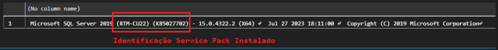
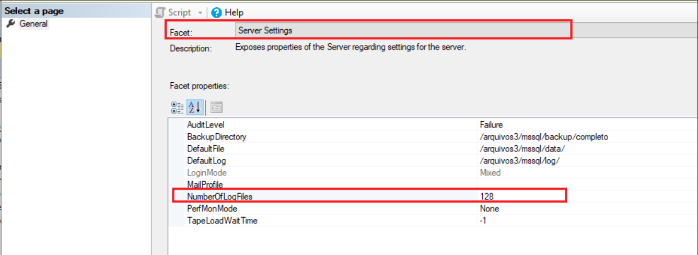

# Power Tuning - Tarefas do Dia a Dia de um DBA

## **Check SQL Server version**

Temos pelo menos duas abordagens para verificar a versão do SQL Server:

- **Approach 1:**

```sql
SELECT
    SERVERPROPERTY('productversion') AS ProductVersion,
    SERVERPROPERTY('productlevel') AS ProductLevel,
    SERVERPROPERTY('edition') AS Edition
```

- **Approach 2:**

```sql
SELECT
    @@VERSION AS Version
```

---

## **Check The current version of the installed Service Pack**

Podemos verificar a versão atual do Service Pack do SQL Server através do seguinte comando:

```sql
SELECT
    @@VERSION
```

Devemos ter um retorno como mostrado abaixo:



---

## **Check and adjust Error Log configuration**

- **SQL Server running in Linux**
  - Via Managment Studio, clique com o botão direito na Instância, em seguida em Facets, em Facet procure por Server Settings e em Facet properties, procure por NumberOfLogFiles e defina o número de arquivos que deseja manter

  

- **SQL Server running in Windows**
  - Via Managment Studio, vá em Managment e clique com o botão direito em SQL Server Logs, em seguida em Configure e marque a opção Limit the number of error log files before they are recycled e em Maximum number of error log files, defina o número de arquivos que deseja manter
  - Via T-SQL ajuste e execute o script abaixo:

    ```sql
    USE master
    GO

    EXEC xp_instance_regwrite N'HKEY_LOCAL_MACHINE', N'Sotware\Microsoft\MSSQLServer\MSSQLServer', N'NumErrorLogs', REG_DWORD, InformarNumeroDesejado
    ```

---

## **Check Collation**

- **Check Instance Collation information**

  ```sql
  -- Retorna Collation da Instancia
  SELECT
    SERVERPROPERTY(N'Collation') SQLInstanceCollation
  ```

- **Check Database Collation information**

  ```sql
  -- Retorna Collation do Database
  SELECT
    DATABASEPROPERTYEX('SampleDB', 'Collation') SQLDatabaseCollation        -- Ajuste o nome do Database, neste exemplo checamos para o Database SampleDB
  ```

- **Checking that the Collation of the Database and the Server are different**

  ```sql
  -- Collation do Database que desejamos comparar
  SELECT
      DATABASEPROPERTYEX('SampleDB', 'Collation') SQLDatabaseCollation
  
  -- Collation do Servidor
  SELECT
      SERVERPROPERTY(N'Collation') SQLServerCollation
  ```

- **Check ALL Database Collation information**

  ```sql
  -- Collation de TODOS Databases
  SELECT
      name,
      collation_name
  FROM
      sys.databases
  ORDER BY
      name
  ```

---

## Conferir onde as databases estão no servidor
  
  ```sql
  SELECT 
    a.name, 
    b.name as 'Logical filename', 
    b.filename
  FROM 
    sys.sysdatabases a
  INNER JOIN 
    sys.sysaltfiles b on a.dbid = b.dbid
  ORDER BY 
    a.name
  GO
  ```

  ---
